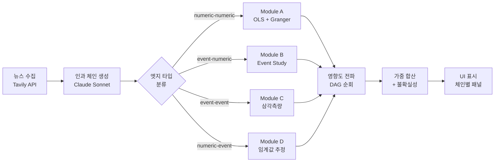
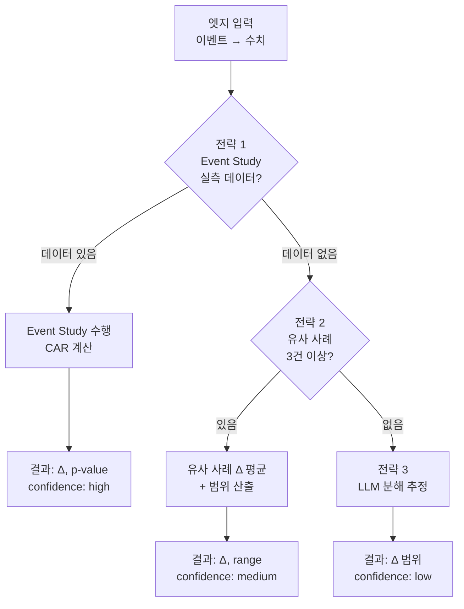
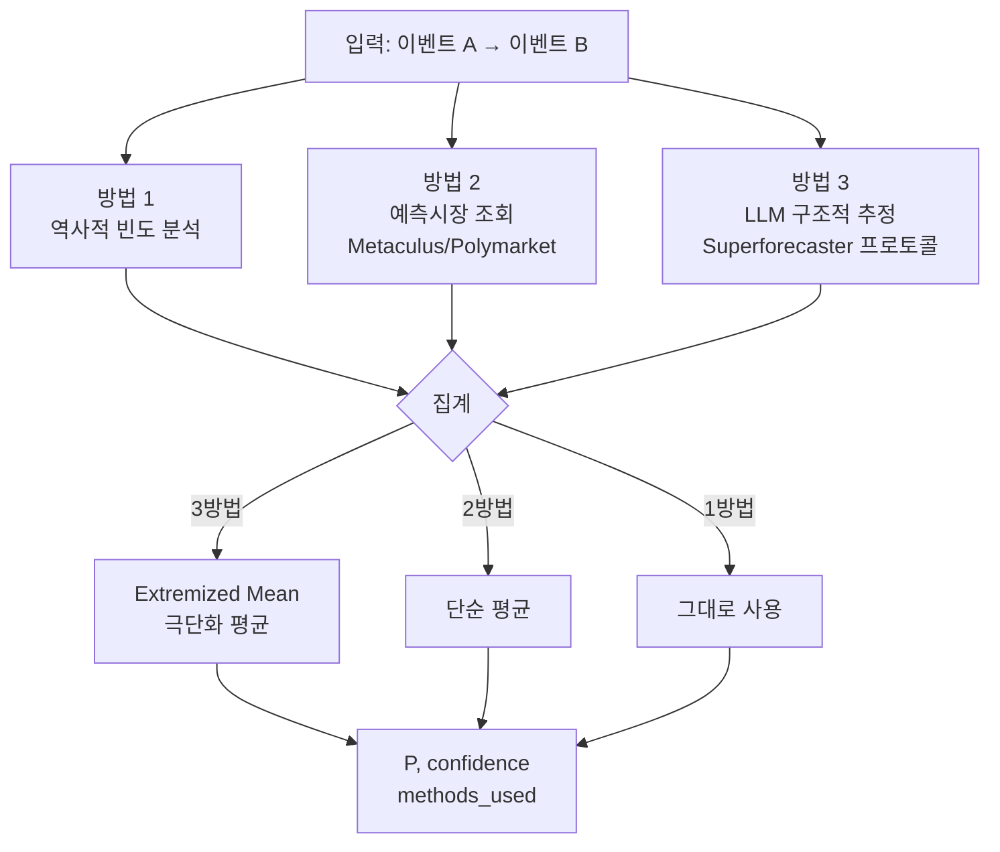

# 엣지 추정 모듈 & 영향도 전파 상세

> **Bullini Causal Map** — 4가지 엣지 타입 추정 모듈 + 영향도 전파/합산 로직 기술 문서

---

## 1. 개요

Bullini Causal Map은 경제 뉴스와 매크로 이벤트를 인과 그래프(DAG)로 구조화한다.
그래프의 노드는 **이벤트(Event)** 또는 **수치(Numeric)** 두 종류이며,
소스-타겟 노드 타입 조합에 따라 4가지 엣지 타입이 결정된다.

### 4가지 엣지 타입 요약

| 엣지 타입 | 소스 → 타겟 | 핵심 파라미터 | 추정 방법 | Module |
|-----------|-------------|---------------|-----------|--------|
| `numeric-numeric` | 수치 → 수치 | β, r, p-value | 시계열 회귀분석 (OLS + Granger) | A |
| `event-numeric` | 이벤트 → 수치 | Δ (변화율 %) | Event Study / 유사 사례 / LLM 분해 | B |
| `event-event` | 이벤트 → 이벤트 | P (확률 0~1) | 역사적 빈도 / 예측시장 / LLM 삼각측량 | C |
| `numeric-event` | 수치 → 이벤트 | θ (임계값) | 규제 조회 / Logistic Regression / LLM | D |

### 전체 파이프라인 연결



각 모듈은 **독립적**으로 동작하며, 추정 결과는 공통 인터페이스
(`params`, `paramMeta`, `confidence`, `rationale`, `sources[]`)로 반환된다.
영향도 전파 엔진은 모든 엣지의 파라미터를 입력받아 체인 단위 / 전체 합산 영향도를 산출한다.

---

## 2. Module A — Numeric→Numeric (β, r, p-value)

수치 변수 간 인과 관계를 통계적으로 추정한다. FRED/DART 등에서 시계열 데이터를 수집하고,
정상성 검정 → 변환 → 최적 시차 탐색 → OLS 회귀 → Granger 인과 검정 파이프라인을 수행한다.

### 파이프라인 흐름도

```mermaid
flowchart TD
  A[데이터 수집\nFRED/DART API] --> B[결측 처리\n선형 보간 / 전방 충전]
  B --> C[정상성 검정\nADF + KPSS]
  C --> D{판단 매트릭스}
  D -->|정상| E[원계열 사용]
  D -->|비정상| F[변환 적용\n차분 / 로그 / 로그차분]
  E --> G[최적 시차 탐색\nlag 1~max_lag]
  F --> G
  G --> H[OLS 회귀\nY_t = α + βX_{t-lag}]
  H --> I[Granger 인과 검정]
  I --> J[결과 반환\nβ, r, p-value, granger_p]
```

### 정상성 검정 판단 매트릭스

ADF(Augmented Dickey-Fuller)와 KPSS(Kwiatkowski-Phillips-Schmidt-Shin) 검정을 동시에 수행하여 교차 검증한다. 두 검정의 귀무가설이 서로 반대이므로, 조합을 통해 보다 견고한 판단이 가능하다.

| ADF 결과 | KPSS 결과 | 결론 | 변환 |
|----------|-----------|------|------|
| H0 기각 (p < 0.05) | H0 유지 (p >= 0.05) | **정상** (high) | 원계열 사용 |
| H0 유지 (p >= 0.05) | H0 기각 (p < 0.05) | **비정상** (low) | 1차 차분 또는 로그차분 |
| H0 기각 | H0 기각 | **추세 정상** (medium) | 추세 제거 후 원계열 |
| H0 유지 | H0 유지 | **모호** (medium) | 1차 차분 적용 (보수적) |

> **ADF vs KPSS 귀무가설**
> - **ADF**: H0 = "단위근 존재 (비정상)" → 기각하면 정상
> - **KPSS**: H0 = "정상 과정" → 기각하면 비정상

### 최적 시차 탐색

lag = 1 부터 `max_lag`까지 각 시차에서 OLS 회귀를 수행하고, 상관계수 |r|과 AIC를 비교한다.

| 기준 | 설명 | 선택 규칙 |
|------|------|-----------|
| AIC | 모델 적합도와 복잡도 균형 | AIC가 최소인 lag 선택 |
| \|r\| | 상관계수 절대값 | AIC 최소 lag와 \|r\| 최대 lag가 다르면, AIC 우선 |
| 유의성 | p-value | 선택된 lag의 p < 0.05 확인 |

```
AIC = 2k - 2ln(L)
여기서 k = 파라미터 수, L = 우도(likelihood)
```

### 신뢰도 판정 기준

| 등급 | 조건 |
|------|------|
| **high** | p < 0.01 AND n >= 120 AND granger_p < 0.05 |
| **medium** | p < 0.05 AND n >= 60 |
| **low** | 위 조건 미충족 또는 LLM 추정 |

### Python 입출력 예시

**요청** (POST `/compute/numeric-to-numeric`):

```json
{
  "x_series": [2.1, 2.3, 2.5, 2.2, "..."],
  "y_series": [4500, 4520, 4480, "..."],
  "frequency": "monthly",
  "max_lag": 12
}
```

**응답**:

```json
{
  "beta": -45.2,
  "r": -0.42,
  "p_value": 0.003,
  "optimal_lag": 3,
  "granger_p": 0.012,
  "transform": "diff",
  "n_obs": 156,
  "confidence": "medium",
  "aic_by_lag": [
    {"lag": 1, "aic": 1842.3, "r": -0.31},
    {"lag": 2, "aic": 1838.1, "r": -0.38},
    {"lag": 3, "aic": 1834.7, "r": -0.42}
  ]
}
```

> **해석**: "CPI가 1단위 상승하면, 3개월 후 KOSPI가 약 45.2포인트 하락하는 경향이 있다 (p=0.003).
> Granger 검정도 유의하여 (p=0.012), 단순 상관이 아닌 예측적 인과 관계가 존재한다."

---

## 3. Module B — Event→Numeric (Δ)

이벤트 발생이 수치 변수에 미치는 영향을 추정한다. 3단계 전략을 순차적으로 시도하며,
상위 전략이 성공하면 하위 전략은 건너뛴다.

### 3단계 전략 흐름도



### Event Study 방법론

MacKinlay(1997)의 표준 Event Study 방법론을 따른다.
핵심 개념은 "이벤트가 없었다면 관측되었을 정상 수익률"과 "실제 수익률"의 차이(비정상수익률, Abnormal Return)를 측정하는 것이다.

| 구간 | 명칭 | 기간 | 용도 |
|------|------|------|------|
| [-250, -11] | 추정창 (Estimation Window) | 약 1년 | 정상 수익률 모형 파라미터 추정 |
| [-10, -1] | 사전 이벤트창 | 10 거래일 | 정보 유출 감지 |
| [0] | 이벤트일 | 당일 | 이벤트 발생 |
| [+1, +10] | 사후 이벤트창 | 10 거래일 | 영향 지속 측정 |

```
AR_t = R_t - (α + β * R_m,t)
CAR = Σ AR_t  (이벤트창 내 합산)

여기서:
R_t = 실제 수익률, R_m,t = 시장 수익률
α, β = 추정창에서 Market Model로 추정
```

### LLM Decomposition Prompting

실측 데이터가 없는 경우, LLM에게 영향을 세분화하여 추정하도록 요청한다.

```
# LLM 프롬프트 예시

이벤트: "미국이 중국산 반도체에 25% 관세 부과"
대상 변수: "삼성전자 주가"

다음 형식으로 영향을 분해하세요:
1. 직접 효과: 삼성전자의 중국 매출 비중 × 관세 영향
2. 간접 효과: 경쟁사(TSMC 등) 반사이익에 따른 시장점유율 변화
3. 심리 효과: 반도체 섹터 전반 심리 위축
4. 상쇄 효과: 대체 수요 발생 가능성

각 경로의 추정 Δ(%)와 근거를 제시하세요.
```

### 신뢰도 판정 기준

| 등급 | 조건 |
|------|------|
| **high** | Event Study 실측 데이터 + p < 0.05 |
| **medium** | 유사 사례 3건 이상 + Δ 수렴 |
| **low** | LLM 분해 추정만 사용 |

---

## 4. Module C — Event→Event (P 확률)

선행 이벤트 A가 발생했을 때 후행 이벤트 B의 조건부 발생 확률 P(B|A)를 추정한다.
다중 방법 삼각측량(triangulation)으로 편향을 줄인다.

### 다중 방법 삼각측량 흐름도



### Superforecaster 프로토콜

Tetlock(2015)의 연구에 기반한 구조적 확률 추정 방법이다. LLM에게 다음 단계를 순서대로 수행하도록 지시한다:

1. **외부 관점 (Outside View)**: 기저율(base rate) 파악. "이 유형의 이벤트가 역사적으로 얼마나 자주 발생했는가?"
2. **내부 관점 (Inside View)**: 현재 상황의 고유한 요인을 분석하여 기저율을 조정
3. **반대 관점 (Red Team)**: 반론을 스스로 제기. "왜 이 확률이 틀릴 수 있는가?"
4. **최종 조정**: 세 관점을 종합하여 확률 산출 (0.05 단위 반올림)

> **Extremized Mean (극단화 평균)**
>
> 3가지 방법의 확률을 단순 평균하면 중앙으로 수렴하는 경향이 있다.
> 이를 보정하기 위해 극단화(extremizing)를 적용한다.
>
> `p_avg = mean(p1, p2, p3)`
> `p_ext = p_avg^d / (p_avg^d + (1-p_avg)^d)`
>
> d는 극단화 계수 (일반적으로 2.5). d > 1이면 확률이 0 또는 1 방향으로 이동한다.

### 베이지안 업데이트

새로운 증거(뉴스, 데이터)가 추가될 때 기존 확률을 업데이트한다.

```
P(B|A, evidence) = P(evidence|B,A) * P(B|A) / P(evidence|A)

사후확률 = 우도비(LR) * 사전확률 / 정규화 상수
```

실제 시스템에서는 LLM이 우도비를 추정하고, 이를 통해 기존 P(B|A)를 갱신한다.
대폭 수정(예: 0.3 → 0.8)이 필요한 경우 사용자 확인을 요청한다.

### 신뢰도 판정 기준

| 등급 | 조건 |
|------|------|
| **high** | 3방법 수렴 (±10%p 이내) + 역사적 사례 10건 이상 |
| **medium** | 2방법 일치 |
| **low** | LLM 단독 추정 |

---

## 5. Module D — Numeric→Event (θ 임계값)

수치 변수가 특정 값에 도달하면 이벤트가 트리거되는 관계를 추정한다.
예: "실업률이 6%를 넘으면 경기침체 선언" 또는 "환율이 1400원을 넘으면 외환위기 우려 부각".

### 3경로 흐름도

```mermaid
flowchart TD
  A[입력: 수치 변수 → 이벤트] --> R1{경로 1\n규제/공식\n임계값 존재?}
  R1 -->|있음| REG[규제 기준 조회\nLLM으로 확인]
  R1 -->|없음| R2{경로 2\n과거 데이터\n존재?}
  REG --> HARD[Hard Threshold\nθ = 공식 기준값]
  R2 -->|있음| LOG[Logistic Regression\nP(event) = sigmoid(x)]
  R2 -->|없음| R3[경로 3\nLLM 추정\n+ 교차 검증]
  LOG --> SOFT[Soft Threshold\nθ + sigmoid params]
  R3 --> EST[추정값\n+ 불확실성 범위]
```

### Hard vs Soft Threshold 비교

| 구분 | Hard Threshold | Soft Threshold |
|------|----------------|----------------|
| **정의** | X >= θ 이면 이벤트 발생 (확률 = 1) | X가 θ 근처에서 확률이 점진적으로 증가 |
| **수학적 표현** | P(E) = I(X >= θ) (지시함수) | P(E) = 1 / (1 + exp(-k(X - θ))) |
| **예시** | 환율 >= 1400원 → "외환 위기 경고" | 실업률 증가 → 경기침체 확률 점진 상승 |
| **파라미터** | θ (임계값 하나) | θ (중심값), k (기울기, 전이 속도) |
| **결정 방법** | 규제/법규 명시 기준 | Logistic Regression 적합 |

```
Sigmoid (Soft Threshold):
P(event | X) = 1 / (1 + exp(-k * (X - θ)))

k > 0 : X 증가 → 확률 증가
k < 0 : X 증가 → 확률 감소
|k| 클수록 전이가 급격 (Hard에 가까움)
```

### 신뢰도 판정 기준

| 등급 | 조건 |
|------|------|
| **high** | 규제/공식 기준 확인 |
| **medium** | Logistic Regression p < 0.05 + ROC AUC > 0.7 |
| **low** | LLM 추정 (미검증) |

---

## 6. 영향도 전파 & 합산

### 단일 체인 전파 규칙

체인 내 각 엣지 타입에 따라 영향도(impact)가 전파되는 규칙이 다르다.
전파는 루트 노드에서 최종 타겟 노드까지 순차적으로 곱셈(또는 할당)으로 진행된다.

| 엣지 타입 | 입력값 | 전파 규칙 | 출력 단위 |
|-----------|--------|-----------|-----------|
| `numeric-numeric` | 상류 ΔX (%) | impact_out = ΔX × β | 타겟 변수 변화량 |
| `event-numeric` | 이벤트 확률 P_src | impact_out = P_src × Δ | 기대 변화율 (%) |
| `event-event` | 이벤트 확률 P_src | impact_out = P_src × P(B\|A) | 후행 이벤트 확률 |
| `numeric-event` | 상류 ΔX | impact_out = sigmoid(ΔX, θ, k) | 이벤트 발생 확률 |

> **전파 핵심 원칙**
> - 이벤트 노드에서 나가는 값은 항상 **확률** (0~1)
> - 수치 노드에서 나가는 값은 항상 **변화량** (Δ%)
> - 엣지를 통과할 때마다 해당 엣지의 파라미터가 **곱셈적으로** 적용
> - 최종 타겟(수치 노드)에 도달하면 결과는 **"기대 변화율(%)"**

### 전파 예시

#### 예시 1: 순수 수치 체인

```
체인: CPI(수치) → 금리(수치) → KOSPI(수치)

Edge 1: CPI → 금리
  β₁ = 0.5 (CPI 1%p 상승 → 금리 0.5%p 상승)

Edge 2: 금리 → KOSPI
  β₂ = -8.0 (금리 1%p 상승 → KOSPI -8% 하락)

시나리오: CPI가 +2%p 상승한다면?
  Step 1: 금리 변화 = 2 × 0.5 = +1.0%p
  Step 2: KOSPI 변화 = 1.0 × (-8.0) = -8.0%

  → 최종 영향도: KOSPI -8.0%
```

#### 예시 2: 혼합 체인 (이벤트 + 수치)

```
체인: "미중 관세 전쟁"(이벤트) → 반도체 수출(수치) → 삼성전자 매출(수치)

Edge 1: 관세 전쟁 → 반도체 수출  [event-numeric]
  P(관세 전쟁) = 0.7 (루트 이벤트 확률)
  Δ = -15% (관세 전쟁 시 반도체 수출 15% 감소)

Edge 2: 반도체 수출 → 삼성전자 매출  [numeric-numeric]
  β = 0.6 (수출 1% 변화 → 매출 0.6% 변화)

계산:
  Step 1: 기대 수출 변화 = 0.7 × (-15%) = -10.5%
  Step 2: 기대 매출 변화 = -10.5% × 0.6 = -6.3%

  → 최종 영향도: 삼성전자 매출 -6.3% (확률 가중)
```

### DAG 위상 정렬 알고리즘

여러 체인이 공유 노드를 가질 수 있으므로, 전체 그래프를 DAG(Directed Acyclic Graph)로
취급하고 위상 정렬(topological sort) 순서로 영향도를 계산한다.

```python
# Python 의사 코드
def topological_propagate(graph):
    # 1. 진입 차수(in-degree) 계산
    in_degree = {node: 0 for node in graph.nodes}
    for edge in graph.edges:
        in_degree[edge.to] += 1

    # 2. 진입 차수 0인 노드(루트)를 큐에 삽입
    queue = [n for n in graph.nodes if in_degree[n] == 0]

    # 3. 위상 정렬 순서로 순회
    while queue:
        node = queue.pop(0)
        for edge in node.outgoing_edges:
            # 전파 규칙 적용
            target_impact = apply_propagation(edge, node.impact)
            edge.to.impact += target_impact

            in_degree[edge.to] -= 1
            if in_degree[edge.to] == 0:
                queue.append(edge.to)
```

### 다중 체인 가중 합산

여러 체인이 동일한 최종 타겟에 도달하면, 각 체인의 영향도를 가중 합산한다.

```
Total Impact = Σ (w_i × impact_i) / Σ w_i

가중치: w_i = confidence_score × (1 - p_value) × completeness
```

#### 가중치 구성 요소

| 요소 | 값 | 설명 |
|------|-----|------|
| `confidence_score` | high=1.0, medium=0.6, low=0.3 | 체인 전체의 최저 confidence 사용 |
| `1 - p_value` | 0~1 | 통계적 유의성 (numeric-numeric 엣지에만 적용, 나머지는 1.0) |
| `completeness` | 0~1 | 체인 내 파라미터 완성율. 미입력(pending) 엣지가 있으면 0 |

#### Null 체인 처리

체인 내 하나라도 `pending` 상태인 엣지가 있으면 해당 체인은 **Null 체인**으로 분류된다.

- Null 체인은 합산에서 **제외**
- UI에서 "정량화 불가" 라벨과 함께 별도 섹션에 표시
- 사용자가 missing 파라미터를 입력하면 자동으로 활성 체인으로 전환

### 불확실성 전파

#### 방법 1: 분석적 방법 (Delta Method)

```
σ²_total ≈ Σ (∂f/∂x_i)² × σ²_i

여기서 f = 전파 함수, x_i = 각 엣지 파라미터, σ_i = 파라미터 표준오차
```

각 파라미터의 표준오차가 알려진 경우 (OLS 회귀의 β 표준오차 등),
편미분을 통해 최종 영향도의 분산을 근사한다. 빠르지만 비선형 전파에는 부정확할 수 있다.

#### 방법 2: Monte Carlo 시뮬레이션

```json
// POST /compute/monte-carlo
{
  "chains": ["..."],
  "n_simulations": 10000
}

// 응답
{
  "mean": -3.2,
  "median": -2.8,
  "ci_95": [-8.1, 1.5],
  "p_positive": 0.12,
  "histogram": ["..."]
}
```

각 파라미터를 해당 분포(정규, 베타, 균등 등)에서 랜덤 샘플링하고,
전파를 N회 반복하여 최종 영향도의 분포를 구한다.
비선형 전파, 꼬리 리스크 평가에 적합하다.

### 시간 지연 필터링

각 엣지에는 `timeLag` (년 단위)이 있다. 체인의 총 시간 지연은 각 엣지 timeLag의 합이다.

| 필터 | 조건 | 설명 |
|------|------|------|
| 6개월 | 총 timeLag <= 0.5 | 단기 영향만 |
| 1년 | 총 timeLag <= 1.0 | 중기까지 포함 |
| 전체 | 제한 없음 | 모든 체인 포함 |

### 최종 UI 표시 예시

체인별 영향도 패널 목업:

```
┌─────────────────────────────────────────────┐
│  KOSPI 영향도 분석  |  필터: 1년             │
├─────────────────────────────────────────────┤
│  🔴 CPI → 금리 → KOSPI              -8.0%  │
│  🟢 AI 수요 → 반도체 수출 → KOSPI    +4.2%  │
│  🟡 미중 관세 → 수출 → KOSPI         -6.3%  │
│  ⚪ 엔화 약세 → 경쟁력 → KOSPI   정량화 불가 │
├─────────────────────────────────────────────┤
│  가중 합산 영향도:  -5.8%                    │
│  95% CI: [-12.1%, +0.5%]                    │
└─────────────────────────────────────────────┘
```

---

## 7. 학술적 근거

- **Wright, S. (1934)**. "The Method of Path Coefficients." *Annals of Mathematical Statistics*, 5(3), 161–215.
  — 경로 계수(path coefficient) 방법론의 원조. 인과 체인의 영향도 전파(곱셈적 분해)에 대한 이론적 토대를 제공한다.

- **Pearl, J. (2009)**. *Causality: Models, Reasoning, and Inference* (2nd ed.). Cambridge University Press.
  — DAG 기반 인과 추론의 핵심 이론. do-calculus, 개입(intervention) 개념, 인과 그래프 구조의 수학적 기초를 정립하였다.

- **MacKinlay, A. C. (1997)**. "Event Studies in Economics and Finance." *Journal of Economic Literature*, 35(1), 13–39.
  — Event Study 방법론의 표준 참조 문헌. 추정창/이벤트창 설정, 비정상수익률(AR) 계산, 통계 검정 절차를 상세히 기술한다.

- **Tetlock, P. E. & Gardner, D. (2015)**. *Superforecasting: The Art and Science of Prediction*. Crown.
  — 구조적 확률 추정의 원칙. 기저율 사고, 관점 전환, 극단화(extremizing) 기법 등 Module C의 프로토콜에 반영되었다.

- **Granger, C. W. J. (1969)**. "Investigating Causal Relations by Econometric Models and Cross-spectral Methods." *Econometrica*, 37(3), 424–438.
  — Granger 인과 검정의 원 논문. 시계열 예측에서 "X가 Y 예측에 기여하는가"를 통계적으로 검증하는 방법이다.

- **Hansen, B. E. (2000)**. "Sample Splitting and Threshold Estimation." *Econometrica*, 68(3), 575–603.
  — Threshold 모형 추정 방법론. 수치→이벤트 변환에서 임계값(θ)을 데이터 기반으로 추정하는 이론적 근거를 제공한다.

- **Kwiatkowski, D., Phillips, P. C. B., Schmidt, P., & Shin, Y. (1992)**. "Testing the null hypothesis of stationarity against the alternative of a unit root." *Journal of Econometrics*, 54(1-3), 159–178.
  — KPSS 정상성 검정의 원 논문. ADF 검정과 함께 교차 검증에 사용된다.

- **Dickey, D. A. & Fuller, W. A. (1979)**. "Distribution of the Estimators for Autoregressive Time Series with a Unit Root." *Journal of the American Statistical Association*, 74(366), 427–431.
  — ADF(Augmented Dickey-Fuller) 단위근 검정의 원 논문.
